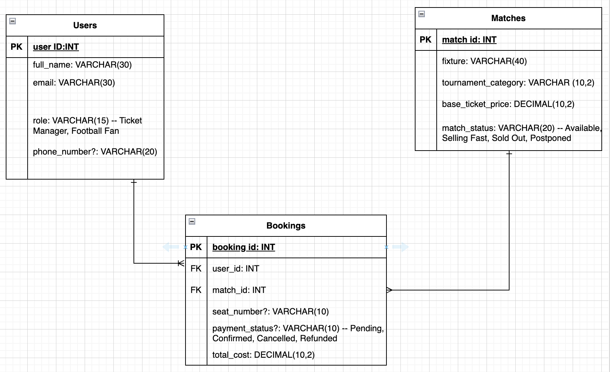

# Football Ticket Booking System 

A relational database design and SQL implementation project for managing football fans, matches, and ticket bookings.

---

##  Overview

This project demonstrates core database concepts through a real-world Football Ticket Booking System, including:

- Database design and normalization
- Entity Relationship Diagram (ERD)
- Primary Keys and Foreign Keys
- Referential Integrity
- SQL queries using joins, subqueries, aggregations, filtering, and pagination

---

##  Folder Structure

```
Football-Ticket-Booking-System/
│
├── QUERY.sql
└── README.md
```

---

##  Part 1: Database Design

### Entity Relationship Diagram (ERD)

The system is built on three main tables:

| Table        | Description                              |
|--------------|------------------------------------------|
| `Users`      | Stores football fan/admin information    |
| `Matches`    | Stores upcoming and past match details   |
| `Bookings`   | Links users to matches via seat bookings |

### ER DIAGRAM 

### Relationships

- **One-to-Many:** One `User` → Many `Bookings`
- **Many-to-One:** Many `Bookings` → One `Match`
- **Logical One-to-One:** Each booking record links one user to one match for a specific seat reservation

---

## Database Tables

### Users

| Field |
|---------|
| user_id (PK) |
| full_name |
| email |
| role |
| phone_number |

### Matches

| Field |
|---------|
| match_id (PK) |
| fixture |
| tournament_category |
| base_ticket_price |
| match_status |

### Bookings

| Field |
|---------|
| booking_id (PK) |
| user_id (FK) |
| match_id (FK) |
| seat_number |
| payment_status |
| total_cost |

---

##  Part 2: SQL Queries

All queries are available in [`QUERY.sql`](./QUERY.sql).

---

### Query 1 — Upcoming Champions League Matches

Retrieve all upcoming matches in the **Champions League** where the status is **Available**.

| match_id | fixture                    | base_ticket_price |
|----------|----------------------------|-------------------|
| 101      | Real Madrid vs Barcelona   | 150               |
| 103      | Bayern Munich vs PSG       | 130               |

---

### Query 2 — Search Users by Name

Search for users whose names start with **Tanvir** or contain **Haque** (case-insensitive).

| user_id | full_name     | email              |
|---------|---------------|--------------------|
| 1       | Tanvir Rahman | tanvir@mail.com    |
| 2       | Asif Haque    | asif@mail.com      |

---

### Query 3 — Bookings with Missing Payment Status

Retrieve bookings where `payment_status` is `NULL`, replacing it with **Action Required**.

| booking_id | user_id | match_id | systematic_status |
|------------|---------|----------|-------------------|
| 504        | 2       | 101      | Action Required   |

---

### Query 4 — Booking Details with User and Match Info

Retrieve booking records joined with the user's full name and match fixture.

| booking_id | full_name     | fixture                    | total_cost |
|------------|---------------|----------------------------|------------|
| 501        | Tanvir Rahman | Real Madrid vs Barcelona   | 150        |
| 502        | Tanvir Rahman | Man City vs Liverpool      | 120        |
| 503        | Asif Haque    | Real Madrid vs Barcelona   | 150        |
| 504        | Asif Haque    | Real Madrid vs Barcelona   | 150        |
| 505        | Sajjad Rahman | Man City vs Liverpool      | 120        |

---

### Query 5 — All Users Including Those Without Bookings

Display all users and their booking IDs, including users who have never booked a ticket.

| user_id | full_name     | booking_id |
|---------|---------------|------------|
| 1       | Tanvir Rahman | 501        |
| 1       | Tanvir Rahman | 502        |
| 2       | Asif Haque    | 503        |
| 2       | Asif Haque    | 504        |
| 3       | Sajjad Rahman | 505        |
| 4       | Jannat Ara    | NULL       |

---

### Query 6 — Bookings Above Average Cost

Find all ticket bookings where `total_cost` is strictly higher than the average cost.

| booking_id | match_id | total_cost |
|------------|----------|------------|
| 501        | 101      | 150        |
| 503        | 101      | 150        |
| 504        | 101      | 150        |

---

### Query 7 — Top 2 Most Expensive Matches (Skipping the Highest)

Retrieve the top 2 most expensive matches, sorted by `base_ticket_price`, skipping the single highest-priced match.

| match_id | fixture                | base_ticket_price |
|----------|------------------------|-------------------|
| 103      | Bayern Munich vs PSG   | 130               |
| 102      | Man City vs Liverpool  | 120               |

---

## 🛠️ Technologies Used

- **PostgreSQL** — Relational database management
- **pgAdmin 4** — Database GUI
- **SQL** — Querying and data manipulation
- **Draw.io** — ERD diagram design
- **GitHub** — Version control and hosting

---

##  Author

**Galib Hasan**

GitHub: [github.com/galibh1](https://github.com/galibh1)
